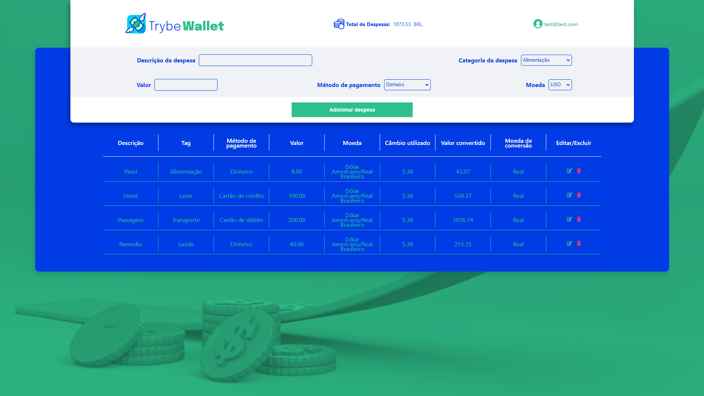

<h1 align="center">Projeto - Trybewallet</h1>

<strong>👨‍💻 O que foi desenvolvido</strong>
 

Neste projeto eu desenvolvi uma carteira de controle de gastos com conversor de moedas, ao utilizar essa aplicação um usuário deverá ser capaz de:

- Adicionar, remover e editar um gasto;
- Visualizar uma tabelas com seus gastos;
- Visualizar o total de gastos convertidos para uma moeda de escolha;

 

<strong>📝 Habilidades</strong>

Neste projeto, fui capaz de:

- Criar um _store_ Redux em aplicações React

- Criar _reducers_ no Redux em aplicações React

- Criar _actions_ no Redux em aplicações React

- Criar _dispatchers_ no Redux em aplicações React

- Conectar Redux aos componentes React

- Criar _actions_ assíncronas na sua aplicação React que faz uso de Redux.

